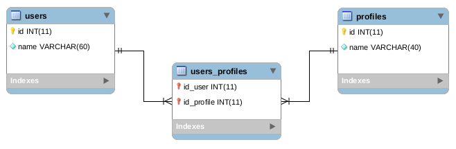

# Hibernate-N-N

## Description
The **Hibernate-N-N** is a project shows how use Hibernate ORM to manipulate a many-to-many relationship.

## Technologies
The project uses the following technologies:

* Java 11
* Apache Maven
* MySQL Server
* Hibernate ORM
* IDE Eclipse

## Database


The above database must be created using the following command:

```
CREATE SCHEMA hibernatenn DEFAULT CHARACTER SET utf8 COLLATE utf8_bin;

USE hibernatenn;

CREATE TABLE users
(
  id INTEGER NOT NULL AUTO_INCREMENT,
  name VARCHAR(60) NOT NULL,
  PRIMARY KEY (id)
);

CREATE TABLE profiles
(
  id INTEGER NOT NULL AUTO_INCREMENT,
  name VARCHAR(60) NOT NULL,
  PRIMARY KEY (id)
);

CREATE TABLE users_profiles
(
  id_user INTEGER NOT NULL,
  id_profile INTEGER NOT NULL,
  PRIMARY KEY (id_user, id_profile),
  FOREIGN KEY (id_user) REFERENCES users(id),
  FOREIGN KEY (id_profile) REFERENCES profiles(id)
);
```

Run the following commands to populate the demo database:

```
INSERT INTO users (id, name) VALUES (1, 'Beltrano Cunha');
INSERT INTO users (id, name) VALUES (2, 'Siclano Pereira');
INSERT INTO users (id, name) VALUES (3, 'Fulano da Silva');
INSERT INTO users (id, name) VALUES (4, 'Acrópolis da Penha');
INSERT INTO users (id, name) VALUES (5, 'Mitrus Gonçalves');
INSERT INTO users (id, name) VALUES (6, 'Bino Alvarenga');
INSERT INTO users (id, name) VALUES (7, 'Goman da Silva');
INSERT INTO users (id, name) VALUES (8, 'Sincom Gomes');
INSERT INTO users (id, name) VALUES (9, 'Beltrana Gomes da Silva');
INSERT INTO users (id, name) VALUES (10, 'Siclana Pinheiro');
INSERT INTO users (id, name) VALUES (11, 'Fulana Pedrosa');
INSERT INTO users (id, name) VALUES (12, 'Duola Andrade');
INSERT INTO users (id, name) VALUES (13, 'Katrina Munhoz');
INSERT INTO users (id, name) VALUES (14, 'Vaz Castro');
INSERT INTO users (id, name) VALUES (15, 'Suli Mascarenhas');

INSERT INTO profiles (id, name) VALUES (1, 'Administrador geral');
INSERT INTO profiles (id, name) VALUES (2, 'Administrador cadastros');
INSERT INTO profiles (id, name) VALUES (3, 'Operador cadastros');
INSERT INTO profiles (id, name) VALUES (4, 'Operador relatórios');

INSERT INTO users_profiles (id_user, id_profile) VALUES (1, 1);
INSERT INTO users_profiles (id_user, id_profile) VALUES (2, 1);
INSERT INTO users_profiles (id_user, id_profile) VALUES (3, 2);
INSERT INTO users_profiles (id_user, id_profile) VALUES (4, 2);
INSERT INTO users_profiles (id_user, id_profile) VALUES (5, 2);
INSERT INTO users_profiles (id_user, id_profile) VALUES (6, 3);
INSERT INTO users_profiles (id_user, id_profile) VALUES (7, 3);
INSERT INTO users_profiles (id_user, id_profile) VALUES (8, 3);
INSERT INTO users_profiles (id_user, id_profile) VALUES (9, 3);
INSERT INTO users_profiles (id_user, id_profile) VALUES (10, 3);
INSERT INTO users_profiles (id_user, id_profile) VALUES (11, 4);
INSERT INTO users_profiles (id_user, id_profile) VALUES (12, 4);
INSERT INTO users_profiles (id_user, id_profile) VALUES (13, 4);
INSERT INTO users_profiles (id_user, id_profile) VALUES (14, 4);
INSERT INTO users_profiles (id_user, id_profile) VALUES (15, 4);
```

## Release History

* 1.0.0 (2021-05-07)
    * First version
